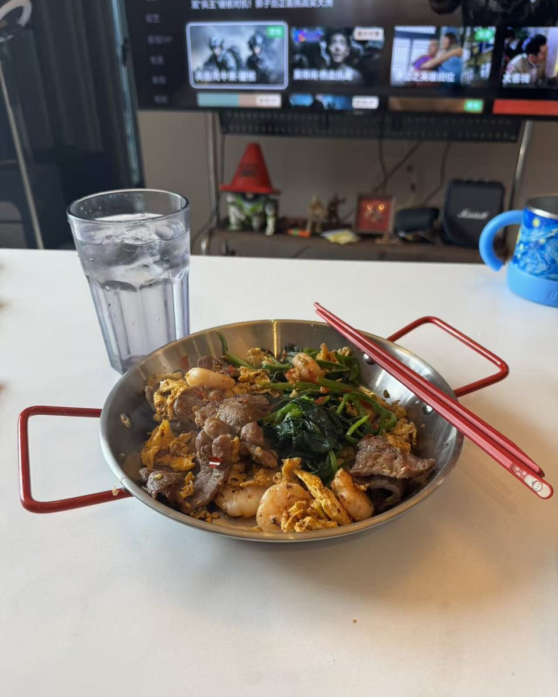
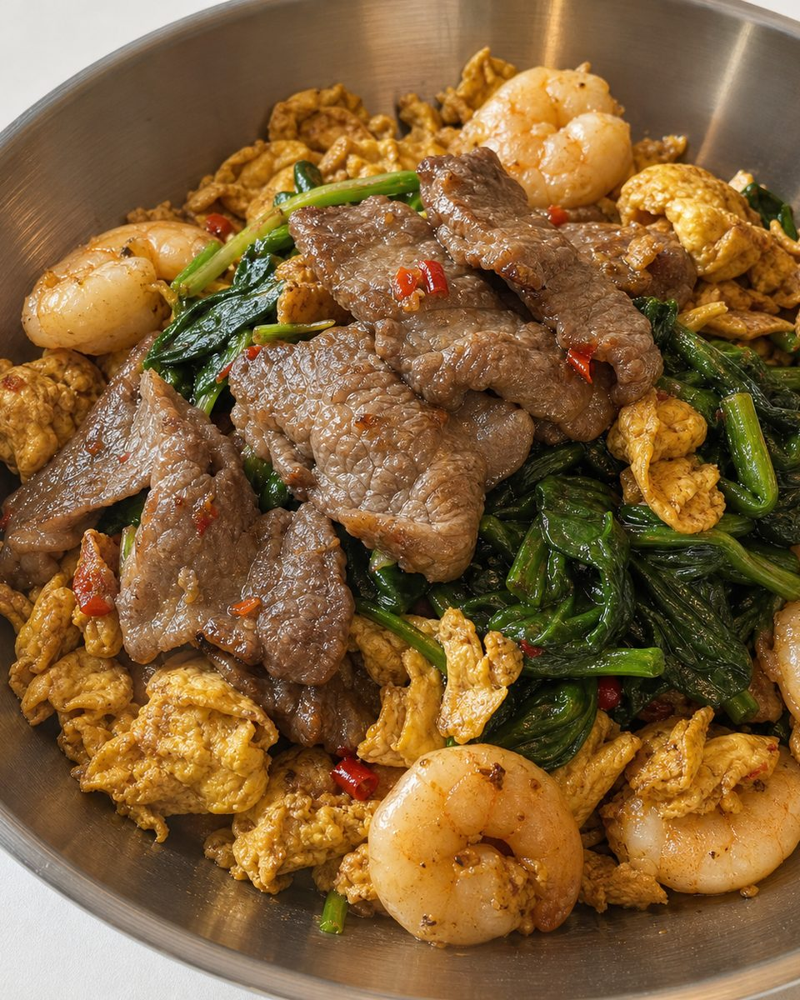
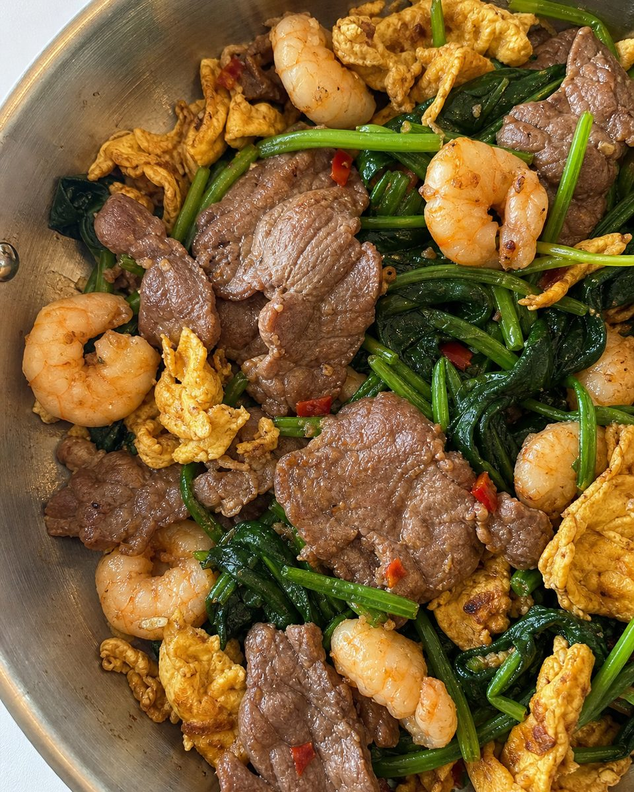
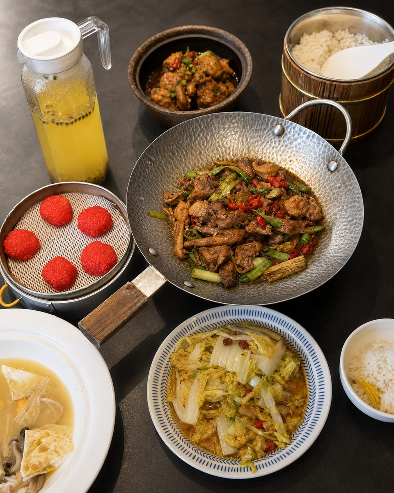
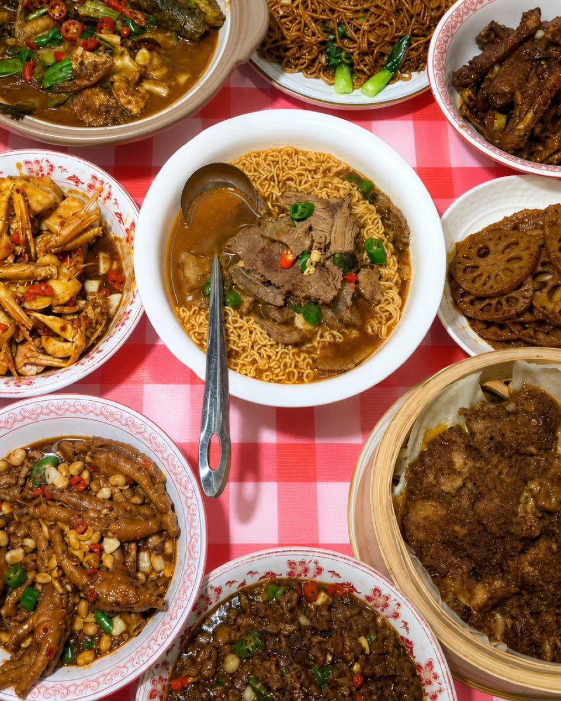
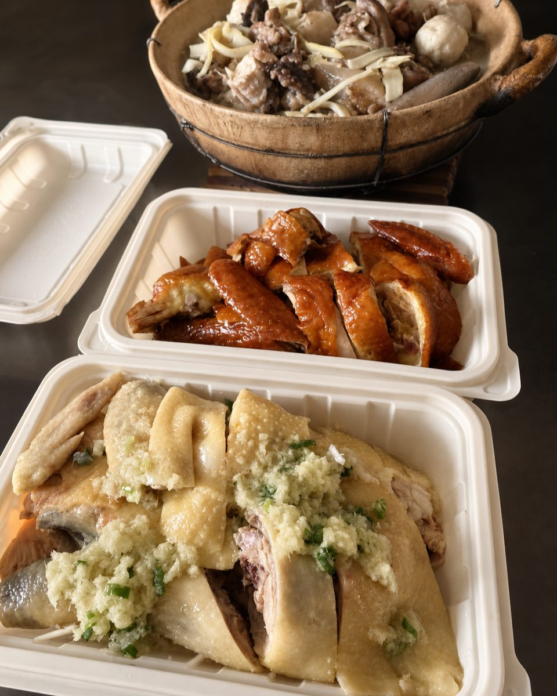
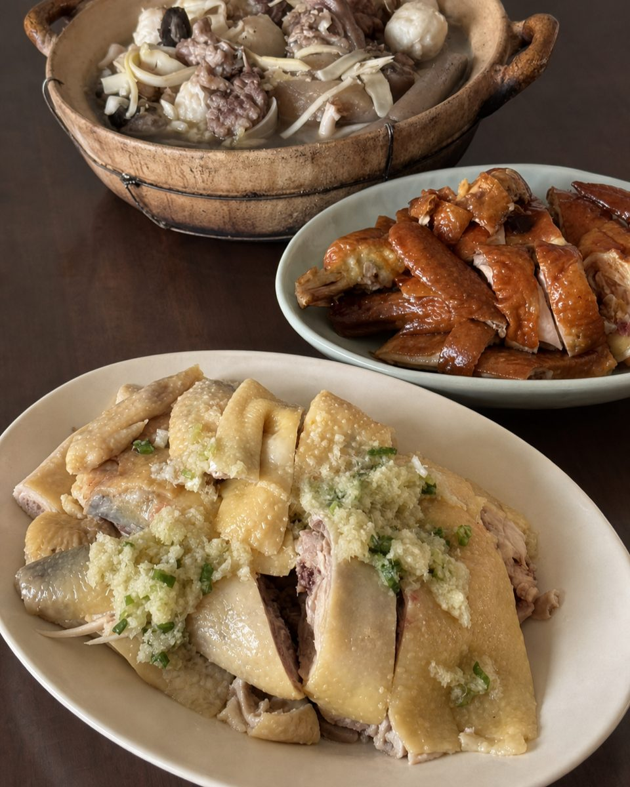
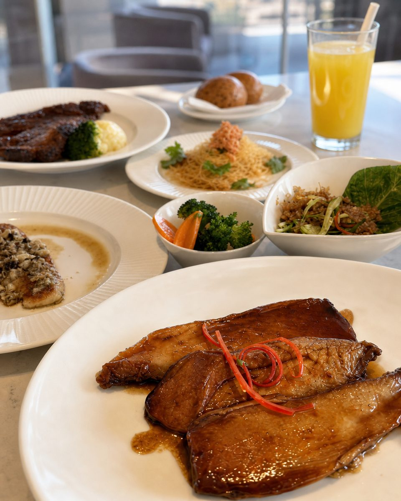
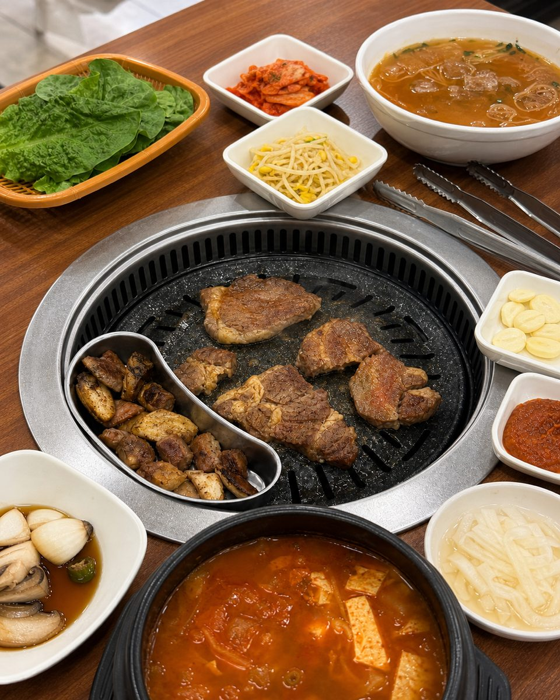
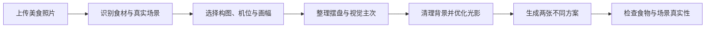

# 随手拍美食优化

> 手残党也能把随手拍，变成可以直接分享的美食照片。

`enhance-food-photos` 是一个面向 Codex 的美食照片优化 Skill。上传一张普通、杂乱、角度欠佳或光线不理想的美食照片，它会先理解真实用餐语境，再重新完成构图、机位、裁切、摆盘、光线与色彩，默认返回两张真正不同的候选成片。

> English: A Codex skill that turns casual food snapshots into two natural, share-ready images while preserving the meal and interpreting the real dining context.

## 先看效果

同一张随手拍，不继承原始画幅，也不只是换滤镜：

| 随手拍原图 | 主视觉成片 | 第二视角成片 |
| --- | --- | --- |
|  |  |  |
| 保留了电视柜、杯子和大面积空桌面，食物没有明确主次 | 主动裁掉干扰背景，以牛肉、虾仁、鸡蛋和蔬菜建立层次 | 用更紧凑的俯拍突出食材细节，提供不同于主图的第二种表达 |

> 示例用于展示生成式编辑方向。发布前仍应检查食材、器皿和场景是否与真实情况一致。

## 它不只是“加个滤镜”

| 能力 | Skill 会怎么处理 |
| --- | --- |
| 📐 构图与机位 | 判断这道菜更适合完整展示、斜俯拍、紧凑俯拍还是局部特写，不强行继承原图比例 |
| 🍽️ 摆盘与主次 | 在不新增食物的前提下，整理同一器皿里的原有食材，建立主食材、层次和色彩节奏 |
| 🧹 背景与杂物 | 裁掉电视柜、斜桌边和无意义空白；移动或移除纸巾、杯子、包装等视觉噪音 |
| ☀️ 光影与质感 | 修正曝光、白平衡、对比和景深，让食物明亮、有食欲，但不过度油亮或商业化 |
| 🧭 场景理解 | 区分餐厅、居家、聚餐、外卖办公和出差等语境，避免把真实生活状态改成另一种场景 |
| 🖼️ 双版本输出 | 默认返回两张在机位、景别或叙事上真正不同的成片，而不是同一张图换两个滤镜 |

## 不同场景，不用同一套答案

### 多菜聚餐：先找主菜，再整理整桌秩序

| 丰盛餐桌 | 紧凑俯拍 |
| --- | --- |
|  |  |
| 保留整桌的热闹感，用锅中主菜建立视觉中心 | 用紧凑俯拍控制盘子之间的密度，让丰盛不等于杂乱 |

### 外卖与工作餐：保留生活状态，也给出精致选择

| 场景保真版 | 精致重摆版 |
| --- | --- |
|  |  |
| 保留外卖盒和原有容器身份，只整理构图、背景与光线 | 明确标注为重摆选择，把同样的食物转移到朴素好看的碟盘中 |

### 更多可识别场景

| 西餐聚餐 | 烤肉聚餐 |
| --- | --- |
|  |  |
| 从多道西餐中选出前景主菜，其余菜品形成有序环境 | 保留烤肉场景的热闹感，让烤盘、冷面和配菜形成完整关系 |

## 双版本策略

| 输入场景 | 第一张 | 第二张 |
| --- | --- | --- |
| 外卖、办公、出差 | **场景保真版**：保留外卖盒和必要的工作或旅途线索 | **精致重摆版**：把同样的食物换入朴素好看的家用碟盘 |
| 聚餐、餐厅、居家、单菜 | **主视觉成片**：建立明确、完整的食物构图 | **第二视角成片**：选择局部近景、不同俯拍角度、餐具互动或精选环境叙事 |

场景保真版不会把“边工作边吃外卖”误改成居家用餐；精致重摆版是明确标注的可选解释，不冒充原始场景。

## 这套 Skill 是怎么做出来的

它不是一段临时拼出来的修图提示词。我先拆解了一组调性统一、角度清楚的美食照片，再把观察到的方法变成可执行规则：

1. **研究角度**：为什么有的菜适合接近俯拍，有的菜需要斜侧近景，什么情况下局部比全景更有食欲。
2. **研究构图**：食物应该占画面多大，盘沿怎么裁，桌面分界线和背景为什么不能随意切过主体。
3. **研究摆盘**：怎样建立主食材、前后层次和颜色节奏，同时保留真实份量与自然交叠。
4. **研究光线**：怎样提亮暗部、修正色温、保留高光和油润质感，又不把食物做成塑料感的商业广告。
5. **研究生活叙事**：外卖盒、电脑、酒店书桌和多人座位有时不是杂物，而是在说明“这顿饭为什么这样吃”。
6. **反复实测**：用单菜、多菜聚餐、外卖工作餐、烤肉和西餐等真实案例测试，再把失败原因写回规则中。

参考照片只用于提炼摄影方法，不要求 AI 复制某一张具体作品，也不会把参考图中的食物、器皿、饮品、文字或道具搬进结果。

## 工作流程



## 核心真实性原则

- 不默认新增、替换、删除或复制食物。
- 不改变菜系、烹饪状态和主要食物身份。
- 除明确标注的精致重摆版外，不更换主要器皿或外卖容器。
- 区分叙事锚点与杂物：电脑、外卖盒、酒店书桌或多人座位可能在讲故事，不应被机械删除。
- 成片追求自然、明亮、有食欲的个人分享感，而不是商业菜单广告。
- 单张照片无法支持极端反向机位时，优先采用更强的裁切与局部构图，不虚构大量不可见信息。

生成式图像编辑仍可能改变局部细节。发布前请检查食物、器皿和场景是否符合真实情况。

## 安装

1. 克隆或下载本仓库。
2. 把 `skill/enhance-food-photos` 文件夹复制到 Codex 的 Skills 目录。
3. 重启或重新载入 Codex，使 Skill 被发现。

macOS/Linux 的常见目标位置：

```bash
cp -R skill/enhance-food-photos ~/.codex/skills/
```

如果你配置了自定义 `CODEX_HOME`，请复制到其中的 `skills` 目录。

## 使用

上传至少一张清晰可见的美食照片，然后调用：

```text
使用 $enhance-food-photos 优化这张照片，给我两张适合发朋友圈的方案。
```

也可以补充想保留的生活状态：

```text
使用 $enhance-food-photos 优化这张外卖工作餐。第一张保留加班氛围，第二张可以换盘。
```

```text
使用 $enhance-food-photos 优化这一桌菜。要看起来丰盛热闹，但不能杂乱，也不要删掉重要菜品。
```

## 项目结构

```text
.
├── README.md
├── VERSION
├── docs/
│   └── images/                 # 经授权公开的 README 展示图
└── skill/
    └── enhance-food-photos/
        ├── SKILL.md
        ├── agents/openai.yaml
        └── references/
            ├── prompt-recipes.md
            ├── quality-rules.md
            └── style-profile.md
```

Skill 目录保持精简；图文介绍、安装说明与开源文档只放在仓库根目录和 `docs/` 中，不增加 Skill 触发后的上下文负担。

## 隐私与示例图片

`docs/images/` 只包含经图片提供者明确授权公开展示的案例，并已统一文件名、压缩尺寸和移除元数据。其他测试照片、聊天内容、本地路径、生成记录和私人输出仍由 `.gitignore` 排除，不会进入开源包。

## 贡献

欢迎通过 Issue 提交失败案例和场景建议。提交示例图片前，请确认你拥有公开分享这些图片的权利，并清除其中的人脸、地址、订单信息和其他个人信息。

## License

[MIT License](LICENSE)
